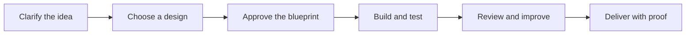

<div align="center">
  
  <h1>Star Forge</h1>
  <p><strong>Describe the software you want. Star Forge takes it from idea to tested delivery in Codex.</strong></p>
  <p>
    <a href="https://github.com/khaledayeva/star-forge/actions/workflows/ci.yml"></a>
    
    
    
  </p>
</div>

Star Forge is a software factory for Codex. Call it once and it will clarify your
idea, help choose a design, create a plan, build the project, test it, review it,
and deliver the result.

It coordinates the best available Codex tools, official plugins, MCP servers, and
project workflows. Star Forge manages the process while specialist tools do the
work they are best at.

## Quick Start

Install from the GitHub marketplace:

```sh
codex plugin marketplace add https://github.com/khaledayeva/star-forge
codex plugin add star-forge@star-forge
```

Start a new Codex task in the project where you want the software built:

```text
$forge Build a private iOS app for tracking shared household expenses
```

That is enough to begin. Star Forge will ask for the decisions it actually needs
and record safe assumptions for the rest.

To continue after a break:

```text
$forge Resume where we left off
```

## How It Works



1. **Clarify**: Star Forge asks focused questions about scope, users, design,
   security, and delivery.
2. **Design**: For visual products, it proposes grounded design directions.
   Non-visual projects skip this step.
3. **Approve**: You review one clear Blueprint before implementation begins.
4. **Build**: Work is broken into traced tasks and routed to the best available
   tools.
5. **Verify**: Each task is tested on the current source, including browser or
   simulator checks when appropriate.
6. **Deliver**: Independent review and a strict completion gate must pass before
   the project is called finished.

## Tools Star Forge Can Use

Star Forge selects tools based on the project and reports when a preferred option
is unavailable.

| Project need | Typical tools |
| --- | --- |
| Product and UI research | Mobbin, Figma, ImageGen, supplied references |
| Web apps | Build Web Apps, in-app Browser, Playwright, Sites, Vercel |
| iPhone and iPad apps | Build iOS Apps, XcodeBuildMCP, iOS Simulator Browser |
| Mac apps | Build macOS Apps, Xcode and SwiftPM workflows, Computer Use |
| Repositories and delivery | GitHub, Git, project CI, platform delivery tools |
| Security and quality | Codex Security, project scanners, adaptive reviewers |

Other official plugins and MCP servers are selected through a versioned capability
catalog when they materially improve the work. Optional plugins are suggested,
never installed or connected without your approval.

## Mobbin Design Research

Mobbin is the first choice for researching real interaction patterns during visual
planning. Its findings go directly into the Blueprint as ideas to borrow, patterns
to avoid, and original product-specific constraints. Star Forge does not copy
screens or produce clone instructions.

In Codex Desktop, connect Mobbin through its supported OAuth flow in ChatGPT. Codex
Desktop reuses that App connection. For Codex CLI:

```sh
codex mcp add mobbin --url https://api.mobbin.com/mcp
codex mcp login mobbin
```

Star Forge does not request or store a Mobbin API key.

## Built-In Safety

- Building starts only after you approve the Blueprint.
- GitHub repositories are private by default when repository creation is approved.
- External writes are limited to the repository and delivery actions you approve.
- Paid resources, destructive changes, public publication, signing, and production
  migrations always require specific permission.
- Tests, review findings, and delivery evidence are tied to the current source.
  New source changes make affected proof stale.
- Missing tools, credentials, or permissions are reported as blockers instead of
  being hidden behind unverified claims.

## What Counts as Done

Star Forge finishes only when `done --strict` confirms that:

- the approved Blueprint has not changed;
- every planned task is complete and verified;
- required browser, simulator, security, and platform checks pass;
- the final review has no unresolved blockers;
- the requested delivery is proven; and
- the Git working tree is clean.

If you change a completed project, Star Forge opens an isolated change packet and
reruns only the affected work and checks.

## Useful Commands

Most users only need `$forge`. These commands are useful when inspecting a project:

```sh
python3 scripts/star_forge.py status --project .
python3 scripts/star_forge.py quality --project . --strict
python3 scripts/star_forge.py review --project . --strict
python3 scripts/star_forge.py done --project . --strict
```

Check an installed copy without changing it:

```sh
python3 /path/to/star-forge/scripts/star_forge.py doctor \
  --source-root /path/to/star-forge \
  --strict
```

## Learn More

- [Installation and upgrades](docs/install.md)
- [Complete workflow](docs/workflow.md)
- [Proof recipes](docs/proof-recipes.md)
- [Validation and release checks](docs/validation.md)
- [v0.3 to v0.4 migration](docs/migration-v04.md)
- [Troubleshooting](docs/faq.md)

## Development

```sh
scripts/check.sh
scripts/release-check.sh
```

See [CONTRIBUTING.md](CONTRIBUTING.md) for contribution guidance.

## Security

Never commit credentials, OAuth tokens, private screenshots, scanner secrets, or
private project content as evidence. Report vulnerabilities privately through
GitHub Security Advisories as described in [SECURITY.md](SECURITY.md).

## License

MIT. See [LICENSE](LICENSE).
