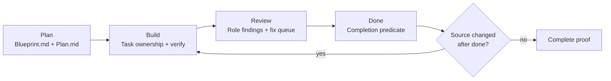
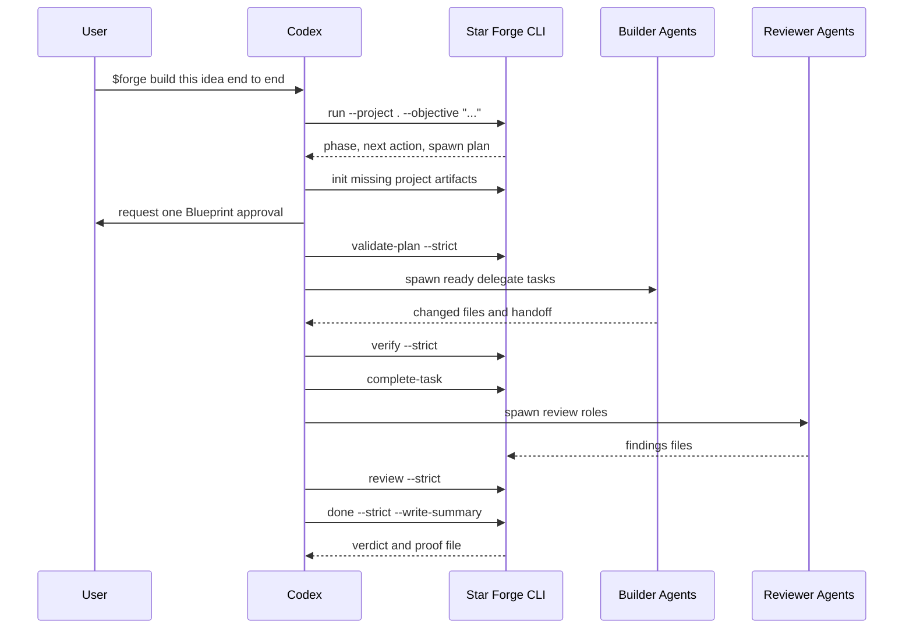
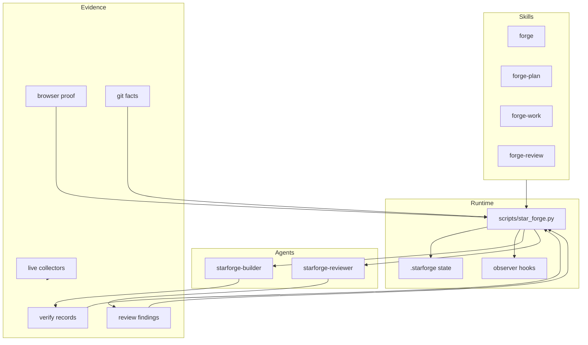

<div align="center">
  
  <h1>Star Forge</h1>
  <p><strong>A Codex-native software factory that plans, builds, reviews, and proves completion.</strong></p>
  <p>
    <a href="https://github.com/khaledayeva/star-forge/actions/workflows/ci.yml"></a>
    
    
    
  </p>
</div>

Star Forge turns an idea into a governed project loop: plan the work, build it
with explicit task ownership, review it with role-based agents, and compute
completion from evidence instead of narrative claims.

It is for Codex users who want an agent to keep moving across long projects
without losing the thread after compaction, skipping review, or calling work
complete before the repository can prove it.

## Why Star Forge Exists

Agentic coding is good at producing a promising first pass. The harder problem is
finishing responsibly. Plans drift, concurrent agents edit the same files,
verification becomes a sentence instead of a command, review becomes optional,
and context disappears during long sessions.

Star Forge makes those failure points explicit parts of the workflow. It gives
Codex a durable state machine, precise task ownership, reproducible checks,
source-bound review findings, and a completion predicate derived from git facts.
The goal is not more ceremony. The goal is sustained autonomy with an honest
definition of done.

| Common failure | Star Forge response |
| --- | --- |
| Context is lost after compaction | Every turn starts from a regenerated operating card and canonical state. |
| Multiple agents collide | Plan tasks declare owned files and dependencies before work starts. |
| Verification is asserted but not run | Task completion requires captured output from the declared command. |
| Review is skipped or becomes stale | Reviewer findings are bound to the current source hash and feed a fix queue. |
| An agent declares victory too early | `done --strict` computes the verdict from current repository evidence. |
| A completed project changes later | Source drift automatically reopens the loop as an amendment. |

## What It Does

Star Forge packages a full project workflow:

- `forge`: the main entry point for new projects, resumes, status checks, MVPs,
  compaction recovery, and cruise-control style continuation.
- `forge-plan`: turns an objective into `Blueprint.md` acceptance criteria and a
  tasked `Plan.md`.
- `forge-work`: routes ready tasks to builder agents, records verification, and
  completes tasks through proof gates.
- `forge-review`: runs the review wave, merges findings into a fix queue, handles
  waivers, and computes the final verdict.
- Native Codex agents: `starforge-builder` and `starforge-reviewer`.
- Observer hooks: continuity and diagnostic hooks for session start, prompt
  submit, tool use, sub-agent events, stop, and pre-compaction.
- Live evidence collectors: browser, preview URL, GitHub PR, native iOS, native
  macOS, and security scanner adapters.
- A deterministic CLI runtime in `scripts/star_forge.py`.
- Templates, examples, fixtures, probes, and a full release test suite.

## Install

### Requirements

- Codex with plugin support
- Git
- Python 3.10 or newer
- A POSIX shell for the installer and release scripts

Browser, native, and external security collectors have their own optional tool
requirements. The core Forge Loop does not require them unless a task needs that
kind of evidence.

Star Forge ships with an installer that creates a standard local Codex
marketplace snapshot from your checkout. No manual marketplace editing is needed.

```sh
git clone https://github.com/khaledayeva/star-forge.git
cd star-forge
scripts/install-codex.sh
```

Then start a new Codex thread and run `/hooks` if you want the observer hooks for
continuity re-anchors and local diagnostics. Star Forge still works without
trusted hooks.

See the [installation guide](docs/install.md) for Git source installs, hook trust,
and repository layout details.

## Start A Project

Open the project directory in Codex and use the main skill:

```text
$forge build this idea end to end
```

For a lighter review profile that keeps the same verification spine:

```text
$forge build a fast MVP for this idea
```

To resume after a break, a new thread, or context compaction:

```text
$forge resume where we left off
```

Star Forge prints the current phase, required next action, and any ready builder
or reviewer prompts. The Codex coordinator follows that operating card until the
repository reaches a fresh `done --strict` verdict.

## The Forge Loop

Star Forge runs one loop. Every turn begins by recomputing project state from the
repository.



The completion state is computed, not declared. `done --strict` checks the git
tree, task status, fresh verify records, UI proof where needed, fresh review, and
the fix queue. If source changes after a passing proof, the next `run` re-enters
the loop as an amendment.

## Project Flow From Scratch



High-level behavior:

1. `run` initializes a project unless `--no-auto-init` is set.
2. Existing non-Star-Forge projects are protected. Use `--product-slug <name>`
   to create an isolated `work/<name>/` project, or `--adopt-root` to explicitly
   work in place.
3. `Blueprint.md` becomes the product contract, with stable `AC-n` acceptance
   criteria and one approval.
4. `Plan.md` becomes the execution table with exact task status, mode, files,
   dependencies, verify command, and evidence.
5. `delegate` tasks are implemented by spawned builder agents. The coordinator
   records verification.
6. UI tasks must include browser proof. Live evidence collectors can supply
   stricter task-scoped proof artifacts.
7. `complete-task` is the only way a task becomes complete.
8. The review wave writes source-hash-bound findings files.
9. `review --strict` merges findings and tree scans into the fix queue.
10. `done --strict` writes `.starforge/final/proof.json` only when the predicate
    passes.

## Functional Map



## Repository Layout

```text
.codex-plugin/plugin.json      Codex plugin manifest
.codex/agents/                 Installable native Codex agent definitions
agents/                         Builder and reviewer prompt contracts
assets/                         Plugin icon and logo
docs/                           Internal architecture and workflow docs
examples/                       Example Blueprint and Plan
fixtures/                       Test fixtures for collectors and proof gates
hooks/hooks.json                Observer hook wiring
probes/                         Manual hook probe pack
scripts/star_forge.py           Main deterministic CLI runtime
scripts/live_collectors/        Live evidence collectors
skills/                         Codex skill entry points
templates/                      Blueprint and Plan templates
tests/                          Python test suite
```

## Generated Project State

Star Forge creates project-local runtime state under `.starforge/`.

```text
Blueprint.md
Plan.md
StarForge.profile.json
.codex/agents/
.starforge/
  project.json
  state.json
  ledger.jsonl
  state/
  runs/
  tasks/
  reviews/
  final/
  screenshots/
  runtime/
  live/<task-id>/<collector>/
work/<product-slug>/            Optional isolated project root
```

Global durable learnings live outside individual projects:

```text
~/.star-forge/learnings/
```

## Command Surface

Main commands:

- `run`: recompute the state machine, initialize when needed, and print the
  operating card.
- `init`: create Star Forge artifacts, templates, state directories, git
  guardrails, and native agent configs.
- `validate-plan`: parse and validate `Plan.md`.
- `status`: read-only project state.
- `verify`: run and record a task verification command.
- `complete-task`: mark a task complete after proof gates pass.
- `review`: merge reviewer findings and tree scan findings into the fix queue.
- `waive`: record a false-positive review waiver with a reason.
- `done`: compute completion and write final proof.
- `learn`: write durable learnings.
- `agents-install`: install native Codex agent configs.
- `self-test`: validate the package.

Live proof commands:

- `browser-run`
- `preview-proof`
- `proof-run`
- `native-ios-proof`
- `native-macos-proof`
- `security-handoff-packet`
- `security-proof`
- `source-packet-proof`
- `source-packet-github-pr-review`
- `server-lease`

Hook handlers:

- `hook`
- `post-hook`
- `prompt-hook`
- `session-start-hook`
- `subagent-start-hook`
- `subagent-stop-hook`
- `stop-hook`
- `pre-compact-hook`

## Live Evidence Collectors

Collectors are artifact suppliers. They write evidence under
`.starforge/live/<task-id>/<collector>/` and print the strict Star Forge proof
command that should consume those artifacts. They do not complete tasks.

| Collector | Purpose | Typical artifacts |
| --- | --- | --- |
| Browser | Playwright-driven UI proof | desktop and mobile screenshots, interaction JSON, console JSON, manifest |
| Preview | Read-only preview URL checks | HTTP result, headers, smoke checks, deployment metadata, manifest |
| GitHub PR | Read-only PR source packets | PR metadata, diff, reviews, comments, checks, annotations, manifest |
| Native iOS | XcodeBuildMCP evidence normalization | transcript, session defaults, build, launch, test, screenshot or UI snapshot |
| Native macOS | Local macOS app proof | structured build and run results, bundle metadata, screenshot, manifest |
| Security | Security scanner normalization | normalized findings, handoff input, redaction report, input hash, manifest |

Strict proof fails closed when evidence is stale, malformed, degraded, outside the
task-scoped live directory, source-mismatched, runtime-mismatched, or marked with
blocking problems.

## Hooks and Trust Model

Hooks are observers, not police. They help with continuity, changed-file trails,
sub-agent diagnostics, and compaction recovery. They do not block edits, and they
do not create an unqualified witnessed completion in this version.

After installing or upgrading the plugin, run `/hooks` inside Codex and trust the
Star Forge entries if you want observer diagnostics and continuity re-anchors.
The final verdict may still include an advisory suffix because local hook and
sub-agent ledgers are diagnostic rather than trusted completion witnesses.

## Review and Completion Model

Standard projects use three review roles:

- Correctness
- Security
- Architecture

Fast MVP projects use one correctness reviewer while preserving the same proof
spine. Reviewer findings are source-hash-bound and feed the fix queue consumed by
`done`.

Completion requires:

- approved `Blueprint.md`
- complete `Plan.md` tasks
- fresh passing verify records
- browser proof for UI work
- fresh review for the current source hash
- empty or explicitly waived fix queue
- clean git working tree

## Testing

Run the release wrapper from the plugin root:

```sh
scripts/check.sh
```

It validates plugin and hook JSON, compiles the runtime and collectors, and runs
the full Python suite.

Star Forge also includes a stricter package self-test:

```sh
python3 scripts/star_forge.py self-test --strict
```

Star Forge bundles observer hooks at `hooks/hooks.json` while keeping the plugin
manifest compatible with the current Codex schema. Release validation includes
the generic plugin validator, `scripts/check.sh`, and `self-test --strict`.

Current test coverage:

| Test file | Coverage |
| --- | --- |
| `tests/test_star_forge.py` | Core loop, plan parsing, verify records, completion gates, review, waivers, hooks |
| `tests/test_live_proof_commands.py` | Strict proof commands across live evidence domains |
| `tests/test_live_browser_playwright.py` | Browser collector and proof binding |
| `tests/test_live_preview.py` | Preview URL safety and source binding |
| `tests/test_live_github_pr.py` | GitHub PR source packets and read-only guardrails |
| `tests/test_live_native_ios.py` | XcodeBuildMCP evidence contracts |
| `tests/test_live_native_macos.py` | macOS app identity and runtime observation |
| `tests/test_live_security_adapter.py` | Security normalization, provenance, and redaction |
| `tests/test_live_collectors_integration.py` | Release wrapper and live collector integration checks |

## Installation Notes

This repository is a Codex plugin bundle. Install it with `scripts/install-codex.sh`
so Codex receives a standard marketplace snapshot at
`~/.star-forge/codex-marketplace`, then start a new Codex thread so the skills,
agents, and hooks are loaded from the installed package.

For local development, update the plugin cachebuster before reinstalling so Codex
picks up the new bundle:

```sh
python3 /path/to/plugin-creator/scripts/update_plugin_cachebuster.py /path/to/star-forge
codex plugin add star-forge@<marketplace-name>
```

For public install instructions, see the [installation guide](docs/install.md).

For supported release validation, see the [validation guide](docs/validation.md).

For copy-paste proof workflows, see the [proof recipes](docs/proof-recipes.md).

For completion and trust model questions, see the [FAQ](docs/faq.md).

## Contributing And Security

Contributions are welcome. Read [CONTRIBUTING.md](CONTRIBUTING.md) for the
development workflow, release checks, and design constraints that protect the
evidence model.

Please report vulnerabilities privately through GitHub Security Advisories as
described in [SECURITY.md](SECURITY.md). Do not open a public issue containing
exploit details, credentials, or sensitive evidence artifacts.

## What Star Forge Does Not Do Automatically

Star Forge does not push commits, publish packages, deploy services, migrate
databases, or create remote pull requests unless the user explicitly asks. It
keeps proof local to the project and treats remote mutations as separate user
intent.

## License

MIT. See [LICENSE](LICENSE).
