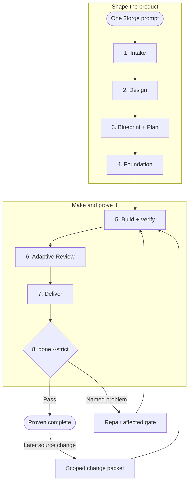
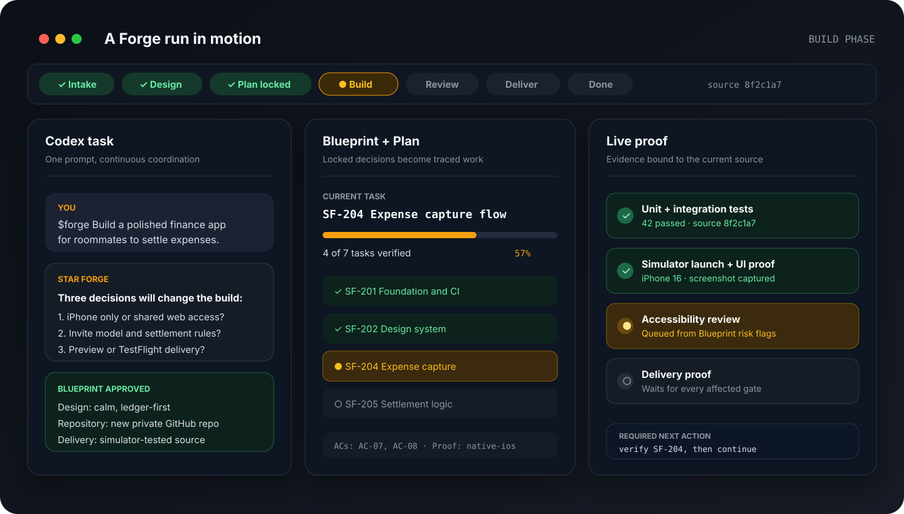
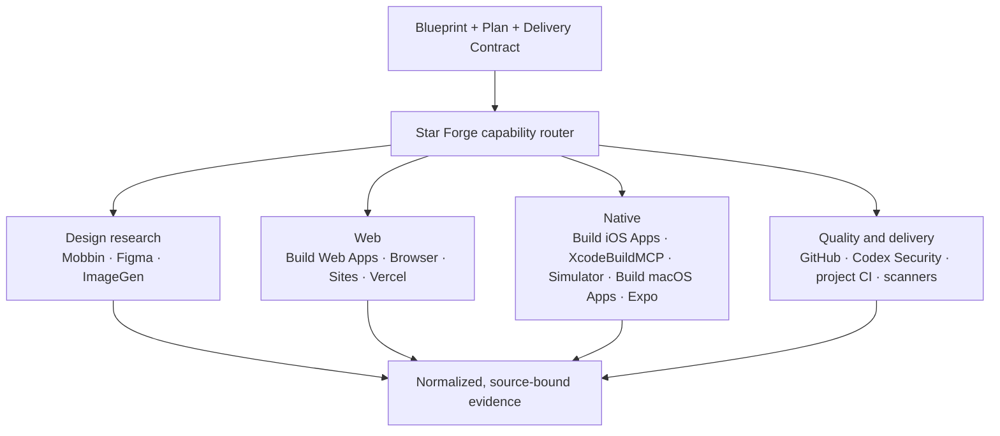
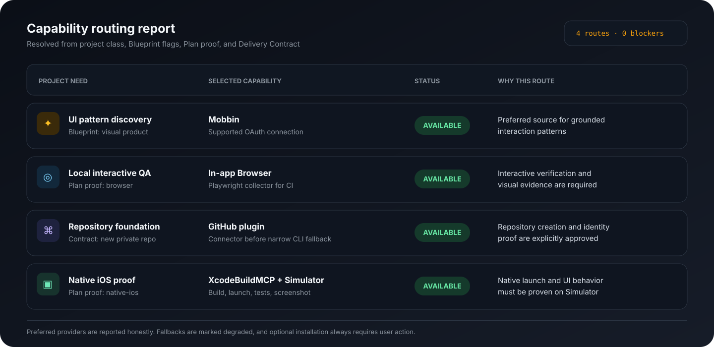
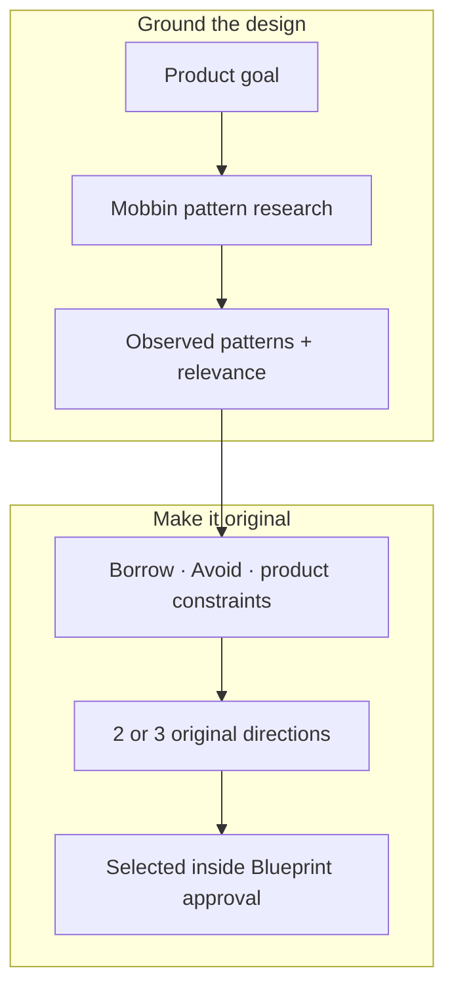
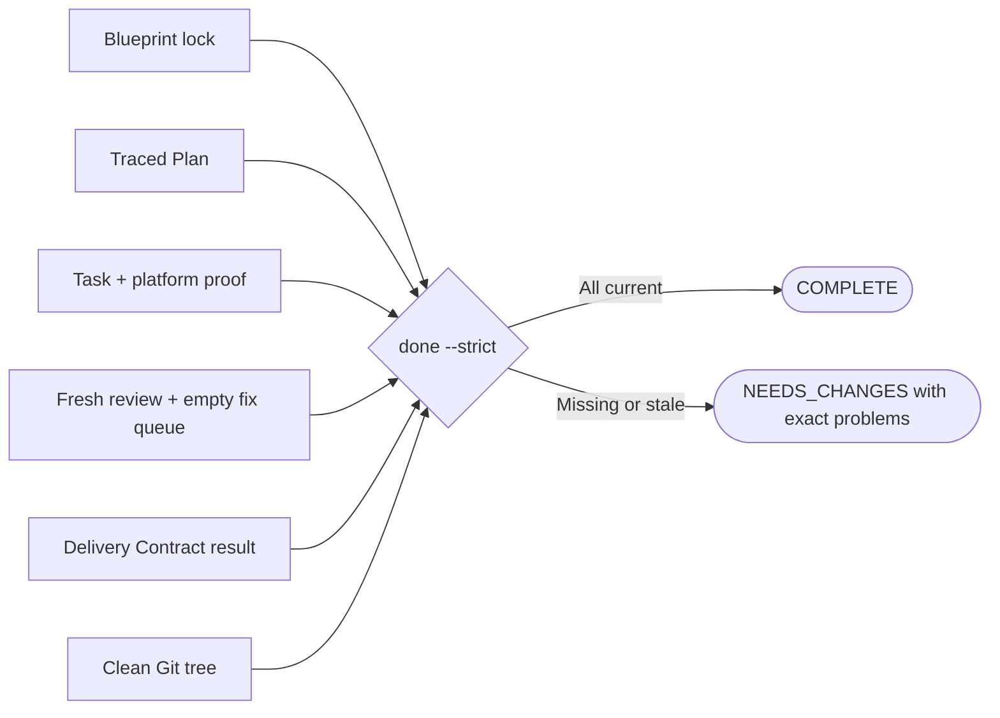

<div align="center">
  
  <h1>Star Forge</h1>
  <p><strong>From one prompt to proven software.</strong></p>
  <p>A lean, Codex-native software factory that interviews, designs, plans, builds, tests, reviews, and delivers complete applications.</p>
  <p>
    <a href="https://github.com/khaledayeva/star-forge/actions/workflows/ci.yml"></a>
    
    
    
  </p>
  <p>
    <a href="#quick-start">Quick start</a> ·
    <a href="#the-forge-loop">Forge Loop</a> ·
    <a href="#capability-routing">Tools</a> ·
    <a href="#proof-review-and-delivery">Proof</a> ·
    <a href="docs/workflow.md">Full workflow</a>
  </p>
</div>

Star Forge is the control plane for a complete software project in Codex. Describe
what you want once and it keeps the work moving from the first product decisions
through a tested delivery. It pauses only when your judgment, credentials, or
authority are genuinely required.

Star Forge owns the lifecycle, contracts, capability routing, evidence, review
policy, and final completion verdict. Specialist Codex plugins, MCP servers,
connectors, simulators, browsers, and repository tools perform the work they are
best at. This keeps Star Forge broad in capability without duplicating every tool
inside the plugin.

> [!IMPORTANT]
> Star Forge does not call a project complete because an agent says it is done.
> Completion is computed from the approved Blueprint, current Git state, fresh
> test evidence, review findings, and the requested delivery result.

## Quick Start

Install from the GitHub marketplace:

```sh
codex plugin marketplace add https://github.com/khaledayeva/star-forge
codex plugin add star-forge@star-forge
```

Start a new Codex task inside the project where you want the software built:

```text
$forge Build a private iOS app for tracking shared household expenses
```

That single invocation owns the full lifecycle. To continue after a break or
context compaction:

```text
$forge Resume where we left off
```

Use “fast MVP” in the request when speed matters. Star Forge reduces optional
breadth, but keeps every security, authority, proof, review, and delivery gate
required by the project risk.

## The Forge Loop



Design is skipped when it does not apply. A later source change does not restart
the whole project: it opens an isolated change packet and repeats only the
affected build, proof, review, and delivery gates.

### Start to finish

<table width="100%">
  <thead>
    <tr>
      <th width="155">Lifecycle stage</th>
      <th>What Star Forge does</th>
      <th>What moves forward</th>
    </tr>
  </thead>
  <tbody>
    <tr>
      <td width="155"><strong>1. Intake</strong></td>
      <td>Inspects the objective and repository, then asks one focused batch of questions that could materially change scope, architecture, privacy, security, or delivery. Safe defaults are recorded as assumptions.</td>
      <td>Resolved decisions, risks, and project class</td>
    </tr>
    <tr>
      <td width="155"><strong>2. Design</strong></td>
      <td>For visual products, researches real patterns and proposes two or three original directions. Mobbin is preferred, with Figma, ImageGen, and supplied references as grounded alternatives.</td>
      <td>Selected visual direction with <code>Borrow</code> and <code>Avoid</code> constraints</td>
    </tr>
    <tr>
      <td width="155"><strong>3. Blueprint + Plan</strong></td>
      <td>Presents one complete contract for approval, locks its content hash, and creates a traced Plan whose tasks map to acceptance criteria and proof types.</td>
      <td>Approved <code>Blueprint.md</code>, lock, and executable <code>Plan.md</code></td>
    </tr>
    <tr>
      <td width="155"><strong>4. Foundation</strong></td>
      <td>Initializes Git and, when authorized, creates or adopts the requested repository, verifies identity and visibility, establishes the default branch, and installs CI before feature work.</td>
      <td>Source-bound foundation evidence</td>
    </tr>
    <tr>
      <td width="155"><strong>5. Build + Verify</strong></td>
      <td>Routes each task to the most specific available capability, coordinates task-scoped builders, and records exact test commands plus browser, simulator, native, or security proof when required.</td>
      <td>Completed tasks with fresh evidence on current source</td>
    </tr>
    <tr>
      <td width="155"><strong>6. Adaptive Review</strong></td>
      <td>Always reviews correctness, then adds UX, accessibility, security, architecture, performance, or reliability lenses from deterministic risk flags. Findings become a fix queue.</td>
      <td>Fresh review with no unresolved blockers</td>
    </tr>
    <tr>
      <td width="155"><strong>7. Deliver</strong></td>
      <td>Produces exactly the approved target: source handoff, private repository, preview, production deployment, package, or platform-specific result.</td>
      <td>Delivery evidence tied to the current commit</td>
    </tr>
    <tr>
      <td width="155"><strong>8. Done</strong></td>
      <td>Runs the strict completion predicate against every contract and evidence gate. If anything is stale or missing, it names the problem and resumes the affected work.</td>
      <td><code>COMPLETE</code> or an honest <code>NEEDS_CHANGES</code> verdict</td>
    </tr>
  </tbody>
</table>

<p align="center">
  
</p>
<p align="center"><sub>Illustrative run snapshot. Star Forge is state-driven, so the next action comes from the project record rather than conversation memory.</sub></p>

### Where you stay in control

Most of the loop is autonomous. Star Forge returns to you for a small number of
meaningful checkpoints:

- material product decisions that cannot be inferred safely;
- approval of the complete Blueprint before implementation;
- optional plugin installation or authentication;
- credentials, signing, billing, production access, or public release; and
- destructive or visibility-changing actions.

Everything else continues in the same `$forge` invocation.

## Capability Routing

Star Forge does not hard-code one stack or force every project through the same
tools. It derives capability needs from the Blueprint, Plan proof types, project
class, risk flags, and Delivery Contract, then resolves them through a versioned
catalog.



The preference order is dedicated plugin or MCP, native Codex capability,
Computer Use, safe repository workflow, then an explicit blocker. A fallback is
reported as degraded instead of being presented as if the preferred provider ran.
Optional plugins are suggested only when they materially improve the approved
outcome, and Star Forge never installs or connects them without your action.

| Need | Preferred route | Typical fallback |
| --- | --- | --- |
| UI pattern discovery | Mobbin | Figma, ImageGen, supplied references |
| Web implementation | Build Web Apps | Existing framework guidance |
| Local interactive web QA | In-app Browser | Headless Playwright collector |
| Authenticated browser state | Chrome | In-app Browser when suitable |
| iOS implementation and proof | Build iOS Apps + XcodeBuildMCP | Project Xcode workflow, Simulator evidence |
| macOS implementation and proof | Build macOS Apps | Computer Use and native project workflow |
| React Native or Expo | Official Expo plugin | Existing repository-native Expo workflow |
| Repository lifecycle | GitHub plugin | Narrow approved `gh` fallback |
| Security-sensitive work | Codex Security | Project scanners and security review |
| Web delivery | Sites or Vercel, selected by contract fit | Source-only handoff |

<p align="center">
  
</p>
<p align="center"><sub>Illustrative routing report. Actual providers and fallbacks depend on the project and the capabilities available in the current Codex host.</sub></p>

### Mobbin in the design phase

Mobbin is the first choice for researching real interaction patterns when a UI is
part of the product. Research flows directly into the Blueprint:



Star Forge uses Mobbin through its supported OAuth connection. It does not request
or store an API key, invent private endpoints, copy screens, or turn references
into clone instructions. If Mobbin is unavailable, the router preserves the
reason and moves through the accepted fallback order without fabricating results.

For Codex CLI:

```sh
codex mcp add mobbin --url https://api.mobbin.com/mcp
codex mcp login mobbin
```

## Proof, Review, and Delivery

Every important claim is tied to the source that was actually tested. Task
verification, browser or simulator proof, foundation checks, review findings, and
delivery evidence all carry source identity. A source change makes affected proof
stale automatically.



Delivery is contract-driven. Star Forge can hand off source, establish a private
repository, create a preview, deploy to production, package an artifact, or
complete a named platform result. It selects one delivery path by fit and does not
configure extra providers opportunistically.

## Built-In Safety

- Implementation starts only after the full Blueprint is approved.
- New GitHub repositories are private by default when creation is authorized.
- Existing repositories are inspected read-only before adoption or mutation.
- Paid resources, public publication, signing, production changes, and destructive
  replacement always require specific authority.
- Credentials, OAuth tokens, private screenshots, and private project content are
  excluded from tracked evidence and global learnings.
- Missing capabilities or permissions become explicit blockers, never hidden
  behind an unverified completion claim.

## Inspect a Project

Most users only need `$forge`. These read-only or diagnostic commands are useful
when you want to inspect the lifecycle directly:

```sh
python3 scripts/star_forge.py status --project .
python3 scripts/star_forge.py quality --project . --strict
python3 scripts/star_forge.py review --project . --strict
python3 scripts/star_forge.py done --project . --strict
```

Check an installed copy without changing it:

```sh
python3 /path/to/star-forge/scripts/star_forge.py doctor \
  --source-root /path/to/star-forge \
  --strict
```

## Documentation

| Guide | Use it for |
| --- | --- |
| [Installation and upgrades](docs/install.md) | Clean installs, upgrades, doctor checks, and duplicate-cache recovery |
| [Complete workflow](docs/workflow.md) | Detailed behavior for every lifecycle phase |
| [Proof recipes](docs/proof-recipes.md) | Browser, preview, iOS, macOS, security, and GitHub proof examples |
| [Validation](docs/validation.md) | Development checks and release gates |
| [Migration](docs/migration-v04.md) | Moving v0.3 projects to the current lifecycle |
| [Troubleshooting](docs/faq.md) | Common setup, routing, evidence, and completion questions |

## Development

```sh
scripts/check.sh
scripts/release-check.sh
```

See [CONTRIBUTING.md](CONTRIBUTING.md) for contribution guidance and
[SECURITY.md](SECURITY.md) for private vulnerability reporting.

## License

MIT. See [LICENSE](LICENSE).
